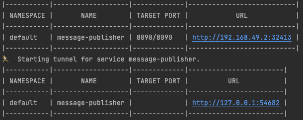

## Message queue service running on kubernetes


### Setup

Install kubernetes, minikube and docker on your machine. Also, install Postman to test the endpoints.
There are two local images built and pushed to docker hub so that we can use in kubernetes.

Start the kubernetes cluster with 8GB of RAM:
``` 
minikube start \
  --memory 8096 \
  --extra-config=controller-manager.horizontal-pod-autoscaler-upscale-delay=1m \
  --extra-config=controller-manager.horizontal-pod-autoscaler-downscale-delay=2m \
  --extra-config=controller-manager.horizontal-pod-autoscaler-sync-period=10s
  
  ```
Increase docker desktop RAM limit if you get resource limited error.

Then, connect to the Docker client to minikube:
```
  minikube docker-env
```

### Deploy the message-consumer service and deployment object:
```   
   kubectl apply -f message-consumer-deployment.yaml
   kubectl apply -f message-consumer-service.yaml
```

### Deploy the message-publisher service and deployment object:

```   
  kubectl apply -f kube/message-publisher-deployment.yaml
  kubectl apply -f kube/message-publisher-service.yaml
```
### Deploy POSTGRES service and deployment object:
```
kubectl apply -f postgresql-deployment.yaml
kubectl apply -f postgresql-service.yaml
kubectl apply -f persistent-volume.yml
kubectl apply -f persistent-volume-claim-1.yaml
```

### Deploy Rabbitmq service and deployment object:
``` 
kubectl apply -f rabbitmq-service.yaml
kubectl apply -f rabbitmq-deployment.yaml
``` 

### Deploy network policy:
``` 
kubectl apply -f resolute-networkpolicy.yaml
``` 

### Run the application in Kubernetes and test the services
Extract the URL exposed by the publisher and consumer pods by running:

``` 
minikube service message-publisher

minikube service message-consumer
```
Copy and paste the load balancer URL like shown below to Postman.
In our case, it is http://127.0.0.1:54682/message/publish.
This is the address we will use for our POST request.



Note, the URL changes each time you restart the pod.

Now, draft a request Json and use postman to post to the endpoint:
```
POST <message-publisher-url>/message/publish

```

```
{

        "ts": "19941114",
        "sender": "haimeng",
        "messageAttributes": {
            "pubisher": "---publisher is ready rabbitmq---",
            "consumer" : "postgres IS READY!"
        }
        "sent_from_ip": "0.0.0.0",
        "priority": 1
}
```
Next, extract the message-consumer URL the same way as above and verify that the message is saved to our Postgres database:

```
GET <message-consumer-URL>/message
```

Underneath of pushing and polling messages to save to database:
1. User post a message to endpoint on the publisher pod.
2. Kubernetes cluster schedules the available nodes to run the pods. Traffic is distributed among the same pods.
2. Message publisher pods will push the messages to a queue hosted by the rabbitmq pods.
4. Message consumer pods will listen and poll from the queue, and save the data to the database running on postgres pod.

### Productionize it

Now that we have our service, I want to scale up the deployment so that it handles more load, e.g. 100k RPS.
To better scale the services and pods, I have decoupled the application to four different components so that they can be scaled independently.
For example, we could have hundreds of message publishers running and a single instance of the message producer.

In this application, currently there is one container per pod. Each pod runs an instance of the application container on the cluster nodes independent of one another.
In need of handling large traffic, we can duplicate the number of pods in deployment to have more instances of each application running.
We can also increase the number of nodes in the cluster where the scheduled pods run. In case of node failure, identical pods will be scheduled on other nodes in the cluster.


In case of large incoming traffic to queue the messages, we can scale the number of replicas to 8 for the message publisher and rabbitmq.

```
kubectl scale --replicas=20 deployment/message-publisher
kubectl scale --replicas=20 deployment/rabbitmq
```

Since we have horizontal pod autoscaling set up, we can also run:
```
kubectl autoscale deployment/message-publisher --min=10 --max=20 --cpu-percent=80
```
If we have the kubernetes autoscaler set up, the autoscaler will add more nodes to the cluster if there are pending pods which could schedule on a new node.

